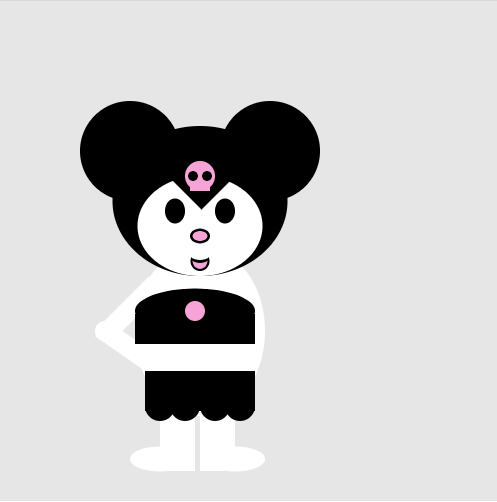

# character-designs-cmd1b
Deze repository hoort bij [opdracht 2F](https://cmd-viscom.gitbook.io/1-2-mmt2/lesprogramma/2-shapes-and-colors/indeling-werkcollege#opdracht-f-character-design).

In deze repo worden alle geëxporteerde .png files getoond van alle Character designs die studenten uit deze klas hebben gemaakt.

* In de **Character design opdracht** moest je de author variabele vullen met je voornaam. Als je dan klikt in het canvas wordt automatisch een export gemaakt van je werk met de naam `[author].png`, bijvoorbeeld `vincent.jpg`.
* Als je die file upload in de root van de main branch, zou je character automatisch in de homepage van deze repo getoond moeten worden.
* Mocht er iets misgaan, contact Vincent Sijben even via Discord.
<table><tr>
<th>Wes</th>
<th>Bas</th>
<th>Tygo</th>
<th>Yente</th>
</tr><tr>
<td></td>
<td></td>
<td></td>
<td></td>
</tr>
<tr>
<th>Tim</th>
<th>Reno</th>
<th>Daan</th>
<th>Isa</th>
</tr><tr>
<td></td>
<td></td>
<td></td>
<td></td>
</tr>
<tr>
<th>Luc</th>
<th>Martijn</th>
<th>Wout</th>
<th>Job</th>
</tr><tr>
<td></td>
<td></td>
<td></td>
<td></td>
</tr>
<tr>
<th>Winston</th>
<th>Guy</th>
<th>Lezanne</th>
<th>Paul</th>
</tr><tr>
<td></td>
<td></td>
<td></td>
<td></td>
</tr>
<tr>
<th>Sam</th>
<th>Imre</th>
<th>Jesse</th>
<th>Miquel</th>
</tr><tr>
<td></td>
<td></td>
<td></td>
<td></td>
</tr>
</table>